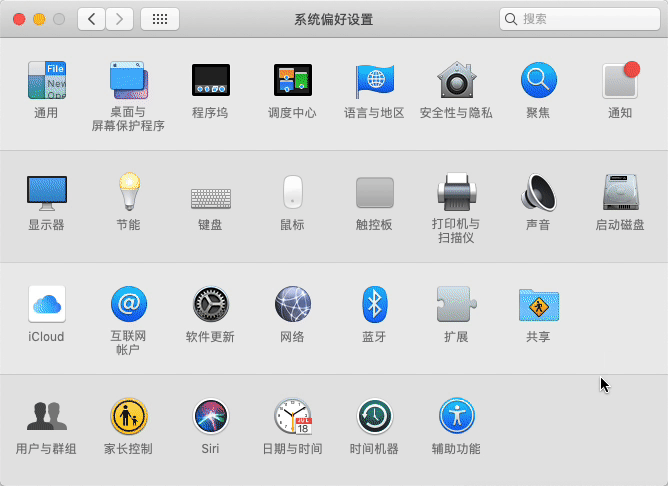

# Printer

ACMCLUB printer's usage & deployment

## Connect

Remember the link `http://printer.upcacm.club/printers/HP-LaserJet-P1008`, it would be used below

### Windows 10

#### Download Driver

[64 bit](./driver/64.zip) / [32 bit](./driver/32.zip) driver is required

Download and decompress it

#### GIF

### macOS

## Deployment

> This part will show you how I build this print server

*TODO*
