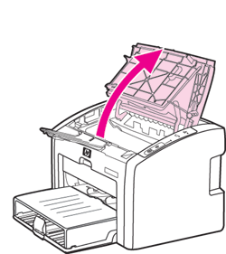

# Printer

ACM 实验室打印机使用 & 异常处理手册

## 1. 连接

### 1.1 Windows 10

#### 1.1.1 下载驱动

下载 [64 位](./static/driver/64.zip) 或 [32 位](./static/driver/32.zip) 的驱动，然后解压到本地

#### 1.1.2 复制链接

复制链接：`http://printer.upcacm.club/printers/HP-LaserJet-P1008`，下一步会用到

#### 1.1.3 添加打印机

跟随视频中的步骤即可

<video width="1024" height="768" controls>
    <source src="./static/Windows_10.mp4" type="video/mp4">
    您的浏览器不支持Video标签
</video>

### 1.2 macOS

#### 1.2.1 复制链接

复制链接：`http://printer.upcacm.club/printers/HP-LaserJet-P1008`，下一步会用到

#### 1.2.2 添加打印机

跟随视频中的步骤

<video width="668" height="486" controls>
    <source src="./static/macOS.mp4" type="video/mp4">
    您的浏览器不支持Video标签
</video>

### 1.3 Linux

#### 1.3.1 复制链接

复制链接：`ipp://printer.upcacm.club/printers/HP-LaserJet-P1008`，下一步会用到

#### 1.3.2 添加打印机

跟随视频中的步骤

<video width="1024" height="768" controls>
    <source src="./static/Linux.mp4" type="video/mp4">
    您的浏览器不支持Video标签
</video>

#### 

## 2. 异常处理

### 2.1 缺纸

如果出现打印机缺纸，请严格按照 2.1.1 ~ 2.1.3 进行操作，不要做任何多余的动作。之后打印机会进行异常恢复，随后继续打印因为缺纸而中断的任务

#### 2.1.1 放入纸张

请放入足够多的纸张

#### 2.1.2 打开打印机的硒鼓舱门

#### 2.1.3 合上打印机的硒鼓舱门

### 2.2 打印的字迹很淡

这是因为硒鼓中的墨粉用完的缘故，请联系学长

## 3. FAQ

1. 打印的文件大小不能超过 `1 GB`，超过这个大小会打印失败
2. 只有在校园内网才可以使用这个打印机，以及访问 [http://printer.upcacm.club](http://printer.upcacm.club)
3. 从技术上讲，可以在任何地方使用这台打印机，但出于安全考虑，限制在校内

## 4. 关于打印机

| 名称 | 值 |
| :---: | :---: |
| 型号 | `HP LaserJet P1008` |
| 是否支持自动双面 | `否` |
| 是否支持彩色打印 | `否` |

## 5. 版权所有

[Lucien Shui](https://github.com/LucienShui)
